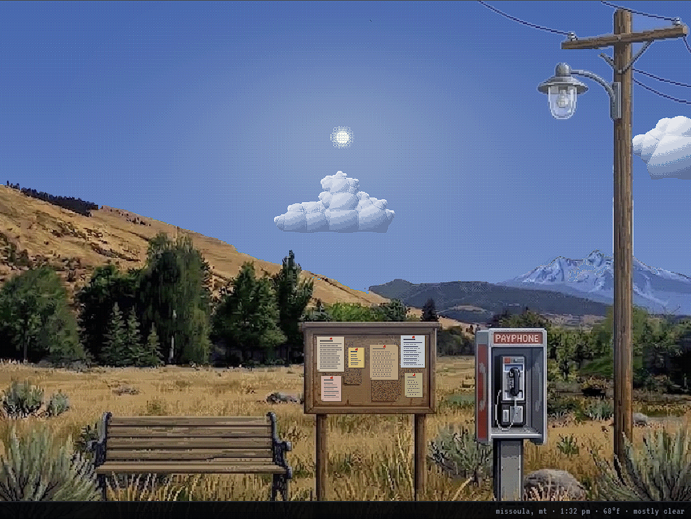

# liminal space

A quiet park scene that lives on the real clock and sky over Missoula, Montana. A bench, a bulletin board, a pay phone, a pole with a lantern, mountains behind. Nothing to win.



## Run it

```
npm run dev
```

Then open http://127.0.0.1:5173. Any static file server works; there is no build step.

## What it does right now

- Hi-res shaded pixel art rendered procedurally on a 960x540 canvas with ordered dithering.
- Sun and moon positions computed for Missoula in real time. Sky, light, and shadows follow.
- Live weather from Open-Meteo (no key needed): cloud cover, precipitation, fog, wind, snow depth. Refreshes every 10 minutes.
- Seasonal snow on the peaks, snow on the ground when there is snow on the ground.
- Hover the pay phone, bulletin board, or bench and click to zoom in. Esc backs out.
- Press `D` for the debug panel: override hour, month, weather, and cloud cover to preview any condition.

## Coming

Goal: have this up and running somewhere public, even barebones, by mid September 2026.

- Pay phone: phone book with numbers, leaving and hearing voicemails.
- Bulletin board: post notes that weather over time and eventually fall off.
- Someone on the bench, rarely.

### Guiding rule: beauty over realism

Everything here should pop: blue sky through the clouds, sparkle on wet grass and dew, bright stars, brilliant sunsets. Weather data and webcams tell the scene what is happening, never what color it is. A webcam frame is gray and flat; this world is not. Smoke season is allowed to be hazy, but it stays full of color: an orange sun, an amber sky, ridges fading to pink and rust rather than gray.

### Weather ideas (procedural only, agreed 2026-09-03)

- Valley inversion fog that pools at the mountain bases and burns off top-down as the sun climbs, inferred from temperature, dew point, and wind even without a fog report.
- A daily snowline: fresh overnight snow on the low slopes that melts by afternoon while the peaks keep it.
- Smoke season: August wildfire haze from Open-Meteo's air quality PM2.5, orange sun, ridges fading out.
- Low cloud ceilings that cut off the peaks on overcast days.
- Wind on the ground: grass, wires, drifting snow.

### Webcam observation feed (idea, 2026-09-03)

Forecast data says how cloudy it is; a camera says where the clouds are. Seeing real clouds halfway up Mount Sentinel while the scene showed them at the top of the sky prompted this. The public Missoula webcams we looked at were not satisfying, so the plan is our own camera.

- A camera pointed at Sentinel and the sky above it, uploading a still every 5 to 15 minutes. Stable mount matters: the analysis assumes fixed framing.
- A small service that grabs the latest frame and publishes one tiny JSON document: cloud ceiling as a fraction of the mountain, snowline fraction, visibility/smoke score, horizon sky color, timestamp.
- The site fetches that JSON the same way it fetches Open-Meteo. The renderer does not need to know a camera exists.
- Analysis: classic image processing against a hand-traced ridge silhouette for ceiling and snowline; optionally a vision model asked a fixed question every 15 minutes for smoke and sky mood.
- This is the intended data source for the low-ceiling and daily-snowline items above.

### Art direction (thinking out loud, 2026-09-03)

- Keep the pixel-by-pixel procedural core. Hone it toward more detail and a more recognizably Missoula look.
- Grass, bushes, and trees that sway a little with the wind so the scene feels alive.
- Concept art comes first as a guide; the procedural scene gets retuned to match it.
- Possibly hand-drawn props (bench, board, pay phone) as PNG sprites, and possibly painted backgrounds in places with procedural overlays (snow, fog, light) on top.

## Layout

```
index.html, style.css     shell and Sierra-style caption bar / panels
src/main.js               loop, live environment (time, sun, weather -> palette)
src/state.js              constants, time zone helpers
src/weather.js            Open-Meteo fetch, WMO code -> conditions, debug presets
src/palette.js            sky and light keyframes by sun altitude
src/render/sky.js         dithered sky gradient, stars, moon, sun
src/assets.js             loads the painted scene and its layer/material mask
src/render/terrain.js     re-lights the painting: seasonal grass, snowline, fog, ambient
src/render/props.js       where the painted props are; notes on the cork, snow caps, shadows, lantern glow
src/render/clouds.js      cumulus sprites: seeded puff layout, height-field shading, five tones
src/render/weatherfx.js   cloud field, rain, snow, fog, lightning
src/render/renderer.js    layer compositor and caches
src/ui.js                 hotspots, camera zoom, panels, debug controls
art/                      concept art: concept_art_03.png is the scene, concept_art_01.jpg the same without props
assets/                   generated backdrop.png, backdrop_mask.png, backdrop.json (tools/build_backdrop.py)
```
