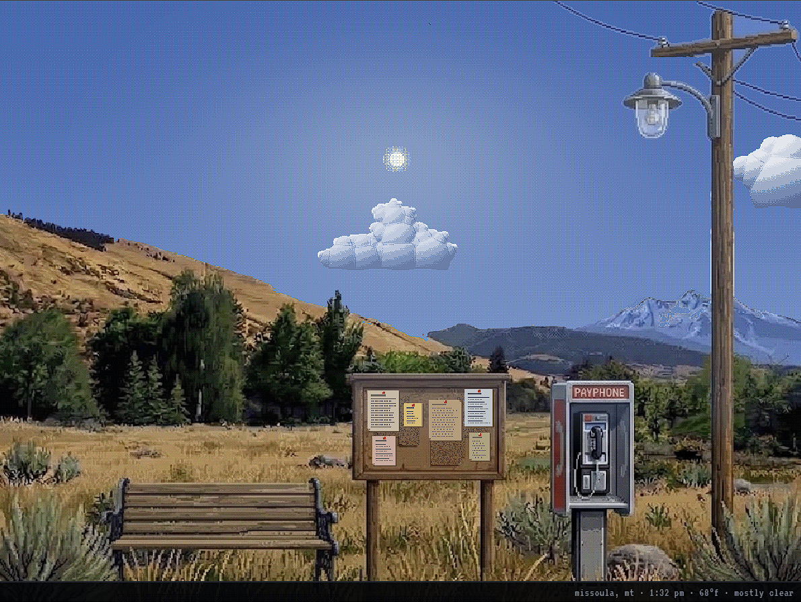

# liminal space

A quiet park scene that lives on the real clock and sky over Missoula, Montana. A bench, a bulletin board, a pay phone, a pole with a lantern, mountains behind. Nothing to win.



## See it

https://liminalbench.net/ (Cloudflare Pages, redeployed on every push to master; the bulletin board there is shared)

The older copy at https://foodbark.github.io/liminal_bench/ still builds from the same branch, with a single-player board, until it is retired with a redirect.

## Run it

```
npm run dev
```

Then open http://127.0.0.1:5173. Any static file server works; there is no build step.

## What it does right now

- The scene is a hand-painted (Gemini) pixel-art backdrop at 2752x1536, re-lit every few minutes by code: sky, sun, moon, clouds, alpenglow, snow, fog, and rain are procedural and dithered; the painting itself is never redrawn.
- Sun and moon positions computed for Missoula in real time. Sky, light, and shadows follow.
- Live weather from Open-Meteo (no key needed): low, mid and high cloud cover become cirrus, altocumulus, stratus, stratocumulus, nimbostratus and cumulus; precipitation, fog, wind, snow depth. Refreshes every 10 minutes. Thunderstorms bring a cumulonimbus and lightning.
- The real night sky: the Bright Star Catalog placed by sidereal time, the Milky Way on dark nights, shooting stars (more during the meteor showers), and a painted moon with its phase that lights the clouds.
- Seasonal snow on the peaks, snow on the ground when there is snow on the ground.
- Hover the pay phone, bulletin board, or bench and click to zoom in. Esc backs out.
- Press `D` for the debug panel: override hour, month, weather, and cloud cover to preview any condition.

## Coming

It has been public and barebones since mid September 2026. Next goal: a real domain, and one thing on the board you can actually touch.

- Pay phone: phone book with numbers, leaving and hearing voicemails.
- Bulletin board: post notes that weather over time and eventually fall off.
- Someone on the bench, rarely.

### Guiding rule: beauty over realism

Everything here should pop: blue sky through the clouds, sparkle on wet grass and dew, bright stars, brilliant sunsets. Weather data and webcams tell the scene what is happening, never what color it is. A webcam frame is gray and flat; this world is not. Smoke season is allowed to be hazy, but it stays full of color: an orange sun, an amber sky, ridges fading to pink and rust rather than gray.

### Weather ideas (procedural only, agreed 2026-09-03)

- Valley inversion fog that pools at the mountain bases and burns off top-down as the sun climbs, inferred from temperature, dew point, and wind even without a fog report.
- A daily snowline: fresh overnight snow on the low slopes that melts by afternoon while the peaks keep it.
- Smoke season: August wildfire haze from Open-Meteo's air quality PM2.5, orange sun, ridges fading out.
- Low cloud ceilings that cut off the peaks on overcast days.
- Wind on the ground: grass, wires, drifting snow.

### Webcam observation feed (idea, 2026-09-03)

Forecast data says how cloudy it is; a camera says where the clouds are. Seeing real clouds halfway up Mount Sentinel while the scene showed them at the top of the sky prompted this. The public Missoula webcams we looked at were not satisfying, so the plan is our own camera.

- A camera pointed at Sentinel and the sky above it, uploading a still every 5 to 15 minutes. Stable mount matters: the analysis assumes fixed framing.
- A small service that grabs the latest frame and publishes one tiny JSON document: cloud ceiling as a fraction of the mountain, snowline fraction, visibility/smoke score, horizon sky color, timestamp.
- The site fetches that JSON the same way it fetches Open-Meteo. The renderer does not need to know a camera exists.
- Analysis: classic image processing against a hand-traced ridge silhouette for ceiling and snowline; optionally a vision model asked a fixed question every 15 minutes for smoke and sky mood.
- This is the intended data source for the low-ceiling and daily-snowline items above.

### Art direction (thinking out loud, 2026-09-03)

- Keep the pixel-by-pixel procedural core. Hone it toward more detail and a more recognizably Missoula look.
- Grass, bushes, and trees that sway a little with the wind so the scene feels alive.
- Concept art comes first as a guide; the procedural scene gets retuned to match it.
- Possibly hand-drawn props (bench, board, pay phone) as PNG sprites, and possibly painted backgrounds in places with procedural overlays (snow, fog, light) on top.

### Flight data (idea, 2026-09-23)

Contrails overhead, and once in a while a plane letting down into Missoula off the Denver or Salt Lake run. Same shape as the weather feed: a live source tells the scene what is happening, the renderer decides what it looks like.

- **Source.** OpenSky Network has a free REST API with bounding-box state queries and no key, which is the closest thing to Open-Meteo's ergonomics; airplanes.live and adsb.fi are the alternates. The anonymous rate limits are thin for a page that polls, but the Cloudflare Worker being stood up for the bulletin board can cache a bounding box around the valley and serve every visitor from one upstream call — the backend pays for itself twice.
- **Two different things to draw.** A jet at cruise is a moving dot with a contrail behind it, crossing over minutes. An arrival is bigger, lower, slower across the frame, gear and flaps if it is close enough to read at this pixel scale, and it belongs on whatever approach actually crosses a south-facing view from the bench — worth checking against real tracks rather than assuming.
- **Contrail persistence is a weather question, and the data is already there.** Whether a contrail hangs for twenty minutes or vanishes in seconds is upper-air humidity and temperature, and Open-Meteo serves pressure-level variables — temperature and relative humidity at 250 hPa. So the same request that draws the sky can decide whether today is a sky full of crossing white lines or one that swallows them. That is exactly the kind of thing this project is for.
- **They are clouds, so light them like clouds.** A contrail at sunset is orange from below and the last thing in the sky still lit after the valley goes blue; `cloudTones` already knows how to do that. At night, an arrival is a blinking strobe and nothing else.
- **Restraint.** Missoula is not busy, and the appeal is that a plane is an event rather than traffic. If the live feed is ever empty or rate-limited, an empty sky is the correct fallback and needs no handling.

**Seen 2026-10-07.** Contrails that lasted all day, every crossing leaving a line that spread instead of fading. Best in the morning, when they were lit pink and orange for a long while before the sun cleared the ridge, over a valley still in blue shade. Two things worth keeping from it:

- **The data agrees, with a conversion.** Open-Meteo had 250 hPa at -50°C all day with relative humidity 42 to 56% over water, which is 70 to 92% over ice (the water-to-ice saturation ratio at -50°C is about 1.65). Contrails persist when the air is supersaturated over ice, and a global model's grid-mean humidity almost never reports that, so the rule has to be a threshold well under 100% over ice: today's 85 to 92% in the morning hours is what "long-lasting" looks like in this feed. Temperature is always cold enough up there; humidity over ice is the whole question. 300 hPa was far drier (24 to 40%), so the level matters.
- **The early light is already in the code.** A contrail at 10 km sees the sun from about 3.3° below the horizon (horizon dip at that height), while the meadow waits until the sun is 4.5° up and Sentinel is backlit all the while. That hour-wide window is the show, and `cloudTones` already blazes undersides from about -6° to +4° and lets the valley sit in sky-shadow, so contrails drawn as thin clouds get it for free. The one check: they should take the ember tone fully even when the low cover is nil, since the cover term in `cloudTones` was tuned for cumulus.

### Paragliders off Sentinel (built 2026-10-07)

Built the same evening: `src/render/gliders.js`, the wings cut from the day's photo (`art/paragliders.png`) by the build, a `gliders` entry in the config for the crest and airspace, a debug select to force them. What the size test settled: a true-scale wing (6 to 10 px here) is a speck that vanishes against the grass, 16 to 22 px reads as a paraglider, and the photo's own wings are 20 px wide, so they are used as shot, pilots and all, two or three times true scale the way the moon is. They fly in the sky above the crest, where your photo has them and where the contrast is. The original note:

Seen from the bench today: a paraglider working the face of Mount Sentinel under a clear sky, 66°F, a 2 to 3 mph breeze out of the southwest. They are a common sight on days like this, winter included, and nobody photographs them; they are just part of what the mountain does. The scene should do it too.

- **No feed, so infer it from the weather, the way the dusting is inferred.** There is no live source for who is in the air. The conditions that put wings on Sentinel are what Open-Meteo already serves: daylight, dry, light wind (roughly under 12 mph at the valley station, from the west or southwest so the launch face is into it), no low ceiling. No temperature rule, since they fly in January. Probability rises through the afternoon with the thermals. A rough gate that is right most of the time is the point; a wing on a day nobody would launch would read as wrong faster than a missing one.
- **The wing is painted, not drawn.** A small sprite from a photo through `tools/pixelate.py --as prop`: at this scale a glider over the face is a bright arc of canopy a dozen or two pixels wide with a dot of pilot hanging under it, and a second, farther one a few pixels. Bright nylon colors are correct and welcome against the brown mountain; low sun warms the canopy like everything else, and once the face is in sky-shadow the wing goes with it.
- **Motion.** Ridge soaring is slow figure eights along the face, turning at each end, drifting gently with the wind direction, climbing a little when the day is good; now and then a long glide out over the valley and down behind the trees to land. Minutes in frame, then gone, and a rest before the next. One or two at a time, more on a perfect spring afternoon, never a flock.
- **Where.** Sentinel is the left edge of the frame and its launch faces the valley, so the wing lives in the air just off that flank and above the ridge, in front of the sky and behind nothing. It is the first daytime thing that moves in the sky; planes and satellites below are data-driven and mostly night, and this one fills the hours they do not.
- **Hover caption,** since a visitor who has not been to Missoula will not know what it is.

### Planets, twinkle and the moving sky (2026-10-08)

Watching the real dusk against the site's:

- [x] **Planets** were missing: the star catalog is stars only, so Jupiter, Saturn, Venus and Mars, the brightest points anyone names, never appeared. Built the same night: `src/util/planets.js`, JPL mean elements and a Kepler solve, drawn steady and untwinkling in the star layer, Venus and Jupiter as a big cross, Mars tinted, hover captions. Checked against the real sky: Saturn a few days past opposition rising in the ESE at dusk, Jupiter and Mars a morning pair in Leo beside Regulus, Venus and Mercury lost near the sun.
- **The star field crawls, the Milky Way jumps.** Stars redraw about once a minute (a quarter degree of sidereal time, about 4 px a minute near the meridian), the Milky Way about every six (it is in the sky-gradient pass, keyed coarser), so it moves in lumps while the stars creep. Key the band finer, or draw it on the star clock.
- **Too many stars twinkling at once.** Down to magnitude 5.2 on a clear dark night is a lot of points, and every one twinkles by a quarter. Real twinkling is strong near the horizon and faint overhead; scale the twinkle by air mass (low stars flicker, high ones barely) and consider a shallower limit when the sky is not fully dark. Two blink artifacts were fixed today (the faintness cutoff saw the twinkle; cirrus dither scrolled over stars), but the user still sees something blink and suspects the cloud and sky movement; sit with it on a real display, at native scale, before changing more.

### How a star should twinkle (2026-10-09)

An evening of tuning the twinkle by hand (bigger swings, smaller swings, faster, slower, size flicks on, size flicks off) never got it right: every version either did nothing or blinked stars out. The user's ideas (stages, size against tone, points that move) and a night sky's actual behavior point at one model:

- **Conserve the light.** The atmosphere smears a star's light over a bigger or smaller patch; it does not switch the light off. So a spread star is larger and dimmer per pixel, a sharp one is small and bright, and the total barely changes. Size and tone must move together through one "spread" value, inversely. Every version that moved them independently changed the total light and read as blinking.
- **The points cycle, they do not blink.** The spikes on a bright star are made by the eye, and they shimmer because the light entering it is churning. Points that swing between upright and diagonal, or lengthen and shorten, keep the light constant and read as sparkle. Arms switching on and off read as a wink.
- **Position wander is real but arcseconds,** far under a pixel here. Skip it; shape is the points' job.
- **Time structure is the whole difference between twinkle and noise.** Real scintillation is mostly calm with occasional sharp glints (a lognormal flicker), not a fresh coin toss ten times a second. A slow smooth wander per star plus a rare brief glint, one every few seconds on a given star, leaves the sky quiet except for the glints the eye catches. The question of the right rate goes away, because most of the time nothing moves.
- **Color, low down.** Near the horizon the atmosphere splits the colors and a star flashes red and blue (Sirius and Fomalhaut seem to change color over the ridge). A glint on a star under about fifteen degrees takes a brief red or blue tint.
- **Planets steady, the faintest stars steady.** A planet is a disc and barely twinkles, which is how people tell them apart. A single-pixel star is below visibility at window scale, so a flick can only make it appear; leave it alone.

Built the same night in the star pass of `sky.js`: one spread state per catalog star, smoothed in time, with glints; size, points and tone derived from it.

### The pay phone's voice: Jane Barbe (idea, 2026-10-10)

The phone should speak in the voice every pay phone had: Jane Barbe, who recorded the Audichron and Electronic Tele-Communications announcements for thirty years. Wanted: the intercept set ("we're sorry, your call cannot be completed as dialed", "the number you have reached is not in service", the SIT tones before each), time ("at the tone, the time will be..."), weather and temperature, the coin prompts.

- **Time and temperature were spliced, which is the opportunity.** The machines assembled her fragments (each hour, minute, degree, "exactly", "and ten seconds"), and collectors have digitized the drums, so the phone can say tonight's real time and temperature from the scene's own clock and feed the way the machines did, not a canned line.
- **Sources.** Telephone World (phworld) and the Evan Doorbell tapes for clean intercepts and time; archive.org's Jane Barbe collections, including drum fragment sets.
- **Rights.** Corporate recordings of Audichron and its successors, never released under any license. A hobby site playing them is common and low risk but not clean; a collector set with stated terms, or a voice actor reading new lines in her cadence, would be. Not a voice model: she was a real person, died 2003, and that is the wrong kind of resurrection for this place.
- **In the scene (the plan, 2026-10-10).** Pick up the receiver as now: dial tone. Then either dial any number on the keypad, or pick one from the phone book, which auto-dials it. Most numbers are not in service and get an intercept: the SIT tones and "we're sorry, your call cannot be completed as dialed" or "the number you have reached is not in service". A few numbers work: the time and temperature line, and answering machines, each a short voice snippet we make (a character's outgoing message, the roadmap's shared voicemails behind it). The phone book is the index, and the working numbers are the easter eggs. Jane Barbe herself, from a fan site's recording, is one of them, for the phone enthusiasts; no voice model, just her.
- **The phone's own number (idea, 2026-10-10).** The bench's listing is the pay phone's own line, and a line calling itself is in use: with nobody else around it gets the busy signal, not a machine (built 2026-10-10: it is a `busy` entry now). When another visitor is in the scene, their pay phone rings instead; click it and the two are connected, typing at each other through the handset, each line shown as what the line says; four rings with no answer and it rings out to the dead line, the way a pay phone does (no machine: pay phones never had one). A stranger's phone ringing in an empty park, and the choice to pick it up, is the whole point. It is real-time, so it needs a presence channel: a Durable Object holding WebSockets is the clean way on Cloudflare; polling the database every few seconds is the crude fallback that fits the free tier at low traffic only. A proper piece, a day or two.
- **Whose answering machine (idea, 2026-10-10).** The machine then stops being "the bench" and belongs to someone else: a character with their own number in the book, and the messages people leave become something to find later, played back from a tape in the scene or read by the character. That gives the voicemail table its reason to exist.
- **Tearing notes down (built 2026-10-10).** Like a real public board: anyone can tear down anyone's note. Someone puts up something you don't like, you tear it down; someone comes and takes everything down, that's just life. On the close-up the pointer names each note and a click on one offers "tear it down". A posted note is gone for good; one of the painting's own leaves bare cork and comes back after a note's life, as if someone put up a fresh flyer; a new pin takes a bare slot first. The limit is loose, six an hour per address, so a person can clear the board and a script cannot keep it bare (`torn` table, DELETE on `api/notes`). This is the board's only moderation, and it answers the posters question the same way.
- **Posters on the board (built 2026-10-10).** People pin their own posters and pictures to the board and they get pixelfied in the look of the photo pipeline, with a second zoom on each. The pin form takes a picture from the device; `src/pixelate.js`, a port of `tools/pixelate.py`'s prop preset, makes it pixel art in the browser (tall, wide or square, 160 to 212 art pixels on a side, under a second) so the original never leaves the device and the server only ever sees the small PNG the page made. Posters sit beside the notes in the same slots, age and blow away with them, and are torn down the same way: click one on the close-up and it is held up large over the dimmed board, with "tear it down" and "put it back". When the slots are full, older posters pile up under the newest, each a little askew, newest on top; each is its picture with a thin white border, and each comes in one of three sizes, a handbill, a flyer or a big sheet that spills over its neighbors. Limits are loose for now: twenty an hour per address, sixty an hour in all, 48 KB. The tear-down is the moderation, as decided.
- **The international line (2026-10-10).** Without the box or the whistle, the Budapest number lands on the long-distance company's operator menu: the 1-800-CALL-ATT menu of February 2002 from Telephone World (`att_menu_2002.mp3`), a wall of "press 1 for a calling card call" with nothing on it this caller can press, no tones in front since it is a routing, then the dead line. Better than any line we could write: it is what a pay phone that cannot bill the call did.
- **Recording the rest (2026-10-10).** With ElevenLabs on hand, the lines Barbe never recorded for us can get a voice of our own; `tools/phone_voice.mjs` puts a take through the telephone band so it sits beside her clips. A candidate, if the menu ever gives way to a pay-phone prompt: file `assets/audio/intercept_international.mp3`, script: "We're sorry. International calls cannot be completed from this telephone without payment. Please deposit three dollars and forty cents for the first three minutes, or hang up and dial your operator. This is a recording." Directions for the voice, so it sits next to her without jarring: a woman, mid-register, unhurried, each phrase set down and left there, a faint Southern warmth, no smile and no apology in it (the "we're sorry" is a form, not a feeling), the cadence of someone reading a card for the ten-thousandth time. Then match the medium: her clips are a telephone band, so run the take through a 300 to 3400 Hz band-pass, mono, 22 kHz, a touch of compression and a whisper of tape hiss, and it will sound like it came off the same drum (`ffmpeg -i take.mp3 -af "highpass=f=300,lowpass=f=3400,acompressor=threshold=-18dB:ratio=3,volume=1.5" -ac 1 -ar 22050 -b:a 48k intercept_international.mp3`). Next in line: the time line's digits, the coin prompts, the machines.
- **Built 2026-10-10, the plumbing:** `src/phone.js` (the call: dial tone, keypad and book dialing, tones made in Web Audio, intercepts with the SIT, the time and temperature line from the scene's own clock and feed, answering machines, recordings, items that unlock numbers, European and British ringback for the long-distance numbers), `functions/api/voicemail.js` and the `voicemail` table (live), `assets/audio/numbers.json` (the directory), `src/items.js` (what a visitor carries; nothing hands items out yet), the phone panel with its keypad and book. Every number works with transcripts and tones until recordings arrive. Unlisted numbers split the way the network did: a line nobody has in the 555 exchange is "not in service", a number in any other exchange "cannot be completed as dialed" (the book carries a crossed-out "home" listing that gets it). The two intercepts speak in Jane Barbe's own voice: `barbe_cannot.mp3` and `barbe_service.mp3`, cut from the Jane Barbe compilation on Telephone World (telephoneworld.org, miscellaneous sounds), and the phone company's number plays the whole compilation, which ends with her interviewed about the work ("Mrs. Jane Barbe of Atlanta, the time and weather"). The Budapest number opens for a blue box or a Cap'n Crunch whistle: the call starts down the same road as without, the operator menu begins, and a few seconds in the whistle blows into the mouthpiece (`whistle.mp3`, the blasts from a collector's comparison video), the menu stops mid-word, the phone beeps back a quarter, and then the single European ring. Items are still not findable: `?give=whistle` or `?give=bluebox` in the URL hands one over for testing, `?drop=` takes it back. Still to come: the time line in her voice (needs her digits spliced from the drum sets), the answering machines' voices, the phone close-up with the keypad on it, finding the box and the whistle.
- **Build notes.** Audio is new to the site: nothing plays until the receiver is lifted, everything is quiet, and the files live in `assets/audio/` with a small manifest of numbers to recordings (the function and D1 can hold the shared voicemails the same way they hold notes). The keypad is drawn on the close-up painting of the phone, like the board's cork, so a phone close-up (the phone alone on black, at the scene's size, from a photo) is the art that unlocks it.

### Satellites (idea, 2026-09-28)

The night sky is already real (catalog stars by sidereal time, the Milky Way, showers from their radiants), and satellites are the one thing a person actually sees moving up there. Public data, no key.

- **Source.** CelesTrak publishes orbital elements (TLEs) for everything, free: the "visual" group is the hundred or so bright enough to see by eye, plus the ISS and the Starlink groups. Elements go stale over days, so fetch them once a day, cached the same way the notes function caches (a Pages Function fetching upstream once and serving every visitor is the shape that already exists).
- **Propagation in the browser.** SGP4 from the elements gives a position for any time; `satellite.js` is the standard library and small, or the handful of formulas can live in `src/util/`. Then the same alt-az to screen mapping the stars use (`skyXY`).
- **Visibility is the interesting rule.** A satellite shows only when it is in sunlight and the ground is dark: the first couple of hours after sunset and before sunrise, and all night in June. That is a shadow-cylinder test against the sun's position, which `solar.js` already has. Deep in a winter night the sky is empty of them, which is correct.
- **What to draw.** A steady dot crossing the frame over two to five minutes, no blinking (blinking is a plane), brightness from the object's standard magnitude and range; the ISS is the bright one and worth a caption on hover. A Starlink train in the weeks after a launch is a line of dots in a row, and people would come to see it. Fading into the Earth's shadow mid-sky is real and looks good.
- **Restraint, again.** A few visible passes a night is the true rate; the sky should not crawl.

## Backlog (2026-09-23)

Three quiet weeks, and the season moved without us. Smoke is done for the year. The valley trees are turning now, the larches on Dean Stone go gold in early October, and first snow on the mountain arrives when it arrives.

### Denver punch list — Monday Sept 28 and Tuesday Sept 29

Two days off work, on a laptop in a coffee shop, four states from the actual weather. Nothing on this list needs to look out a window or sit through a full art build, so it is the code-and-plumbing list. Roughly in order. Status as of Sept 28:

- [x] **Settle whether the painting distinguishes larch from fir.** Done, with `tools/forest_study.py` (hue and value histograms over the forest, plus an overlay tinting the yellow-shifted candidates). Answer: **Dean Stone, no; the valley trees, yes.** Dean Stone's forest is one uniform blue-green (hue median 209°, 85% of its pixels in one value band); the few warm candidates land on the tan clearings and on highlight flecks, not on trees. So the larch scatter has to come from the art, as feared. The valley band is different: 20% of its foliage is warm-shifted and the overlay puts it squarely on the round-crowned deciduous trees between the fir spires, so a `DECIDUOUS` material for the valley trees is a classification job (the 16-apart mask re-spacing in the fall section). Sentinel's shrubs are already painted tan.
- [x] **Kill the calendar first snow.** `src/season.js`. `weather.js` runs a second Open-Meteo query lapsed to Dean Stone's summit (`RIDGE` in `state.js`: 46.771, -113.879, elevation 2050 m, located on Open-Meteo's elevation grid). Five centimetres of model snow depth at the summit latches "winter has come" in localStorage, good for one snow year from Aug 1; until then September through December are held at bare whatever `SEASON_SNOW` says, and after it the table's depth applies with a floor of a white crest. The live summit depth also holds snow up through a warm spell and melts it out in spring. The debug panel's **peaks** select (live / bare / first snow / snowed in) exercises every state before the event; `?debug` in the URL opens the panel on a phone.
- [x] **Bulletin board, step one, no backend.** `src/notes.js`, the compose form in `ui.js`. "pin a note" on the board panel, one line up to 80 characters, Enter pins it; it takes the slot of the most faded default note, on its own paper colour, and lists as "yours". Notes age from the time of posting (yellow and curled by two weeks, gone after sixteen days) and live in localStorage. Typing in the field no longer drives the scene (the D key used to toggle debug). **Step one and a half, same day:** the board zoom now lands on a close-up painting (`art/blank_board.jpg`, the board alone on black, keyed out by the build into `assets/board_closeup.png`) and the notes are set on its cork for real, in the page's font, wrapped to the paper and snapped to hard pixels, so you read the board instead of a list in the panel. The panel docks at the top rail with just the two buttons. A close-up is a config entry (`closeups` in `art/layered.json`: file plus cork rectangle), so the phone and the bench can get one the same way when they have a painting.
- [x] **Stand up the backend: Cloudflare Pages Function + D1.** Code is in the repo (`functions/api/notes.js`, `db/schema.sql`, `wrangler.toml`), written as a Pages Function rather than a separate Worker so it deploys with the site and lives on its origin. Rate limit from the first commit: three notes an hour per address (salted daily hash, no addresses kept), thirty an hour in all. The page probes `api/notes` at load and uses it where it answers, so nothing changes on GitHub Pages. Exercised locally on Sept 28 with `npx wrangler pages dev` over a local D1 (`wrangler` is now a dev dependency): GET, POST, and the per-address 429. Deployed the same evening: `https://liminalbench.net/api/notes` answers, the panel says "Anyone who stops here can read these.", and the board went live empty.
- [x] **Move the site to Cloudflare Pages.** Done Sept 28 evening: Pages project `liminal-bench` builds `master` with the D1 binding, and the first push after the account work shipped the function. Nothing in the code assumes the `/liminal_bench/` prefix. GitHub Pages is still up alongside; retiring it with a redirect is `docs/deploy.md` section 5.
- [x] **Get the domains**, half. `liminalbench.net` is registered and attached to the Pages project with `www`, and http redirects to https. `aplacesortof.net` (Missoula: a place, sort of) is the one still open: register it and set the 301 to `liminalbench.net`, path preserved, per `docs/deploy.md` section 4 step 2. `.net` on purpose for the retro feel.
- [x] **Mobile touch and landscape**, first pass. The UI (caption, panels, buttons) now scales on its own `--u`, floored at 0.8 on touch screens, so a phone can read the captions and the compose field; `touch-action: manipulation` kills the double-tap delay; a phone held upright gets a "turn your phone sideways" line under the letterboxed scene. Tapping the scene while zoomed still steps back, and every panel has a leave button. A true landscape layout (panels that do not cover the board they describe) is still open.

### Seasonal, and only buildable while it is happening

**Which trees turn is the whole problem, and it is not only a fall problem.** Everything that changes color in this valley is scattered inside something that does not. Larch on Dean Stone are individual trees sprinkled through a matrix of pine and fir — a small fraction of the dome, not a band across it. The foreground valley trees are a mix of deciduous and evergreen, and so are the shrubs on Sentinel. The mask does not know the difference: it has one `FOLIAGE` code and one `SHRUB` code, so any tint keyed to material turns every tree on the mountain at once, which is worse than leaving it green.

Telling those apart buys the whole year, not three weeks of October. The same split is what makes **bare trees in winter** possible — and larch are deciduous conifers, so they go gold, then bare, and stand as gray skeletons among green fir until spring, which is most of what a Missoula winter hillside actually looks like. It decides **how snow sits**, too: bare branches catch it as white tracery, fir boughs hold it in slabs, and `terrain.js` already keys snow off material. And it runs the other way in **spring**, when the larch flush a green brighter than anything else on the mountain. Four seasons out of one classification pass. That is worth doing properly rather than cheaply.

- **Does the painting already know which trees are which? (Answered 2026-09-28, see the punch list: Dean Stone no, valley trees yes.)** Larch and cottonwood read a different green than fir, and if that difference survived into the painting then the build can classify it — hue and value histograms over the forest region, a `--debug` overlay tinting the candidates, and a look. This is squarely what the build is for: it masks, classifies and cleans what is painted, and invents nothing. If the answer is yes, the rest is cheap. If it is no, the scatter has to come from the art, because code choosing *which* trees are larch is code drawing the picture. Ten minutes of work and it decides the next three weeks, so do it before anything else in the fall list.
- **If classification works: new material codes, and the packing has to change.** `LARCH` and `DECIDUOUS` want to be materials 8 and 9, but codes are stored `32 *` in the mask's G channel (`tools/build_backdrop.py:362`) and 8 would overflow the byte. Re-space to 16 apart: sixteen codes, snap becomes `(v + 8) >> 4` in `src/assets.js:26`, and the drift tolerance drops from ±16 to ±8 — still far more than the unit or two of color management this defends against. Three places to touch and a rebuild.
- **If it does not: the art supplies the scatter.** An overlay painting over the existing framing, gold dabs where the larch actually are and checkerboard everywhere else, keyed in the way `front` already is. Registration is the risk, so it wants to be derived from the current painting rather than generated fresh.
- **Then the tint, and it should be saturated.** Only a tenth of those pixels change, so a gentle wash across them reads as nothing at all. Real larch season is gold flecked through dark green and it *pops*; the pixels that turn should go most of the way to gold while their neighbors stay fir-dark. Ramp in over about ten days, hold, then drop to bare gray-brown. A channel-ratio tint like `grassTint` may not survive a green-to-gold swing that big — mapping luminance through a gold ramp is the fallback.
- **Bare trees are not a tint, and that is the hard one.** Color is recoloring pixels that are already painted; bare is the leaf mass largely going *away*, with ridge and sky showing through where it was. The painting has nothing behind those trees, because nothing was ever painted there. So winter wants a painted state, not a computed one: the same framing with the deciduous and the larch stripped to branches. Thinning the silhouette by dithering out foliage pixels is the cheap approximation and is worth one screenshot, but expect it to read as moth-eaten rather than bare.
- **Which means: commission the fall and winter states in the same sitting.** If the art has to supply the scatter anyway, get all of it while the framing is loaded and matching — full green, fall, and bare-winter, same composition. Registering three variants painted together is a build problem; registering a winter variant painted in November against a fall variant painted in September is a re-tracing problem. Cross-fade between states by date, the way the tint would have.
- **Spring is a third state, and the prettiest one.** Serviceberry and chokecherry white, lilac, apple and crabapple pink, the larch flush, everything at once and gone in three weeks. Flowering wants its own material code rather than riding on `DECIDUOUS`, because a bush in bloom is not a green bush tinted pink — the bloom sits on the branches as its own layer of color and it is the one time of year those shrubs out-read the mountains.

**This is going to get complicated, so structure it once rather than five times.** Grass already does a small version of the right thing: a per-month keyframe table in `grassColors`, one place, read by a tint function. Generalize that before the species list grows instead of after. One `PHENOLOGY` table keyed by material, giving for any day of the year a color and a leaf-mass fraction where zero is bare — then evergreen is a flat line, deciduous is green to gold to zero to green, larch is the same curve shifted and gold-shifted, flowering adds a bloom color over a two-week window, grass keeps doing what it already does. Every seasonal question becomes an entry in that table instead of another branch in `terrain.js`, the debug panel's month override drives all of it for free, and adding a species is data rather than code.

- **Watch the code budget while planning that.** Re-spacing the mask to 16 gives sixteen material codes; eight are spent today, and `LARCH`, `DECIDUOUS` and `FLOWERING` make eleven. That is fine and it is also most of the room, so settle the whole species list on paper before spending codes one repaint at a time.
- **Timing.** Valley trees are turning now and hold through late October. Larch go around Oct 5 into early November, then stand bare until the spring flush. Sentinel's shrubs come along with the valley. Bare-and-snowy is the state the scene will sit in for four or five months, so it is worth more care than its three-week neighbors. Dean Stone is the favorite mountain; check it first and check it again last.
- **First snow on the mountain top: wait for first snow on the mountain top.** No calendar snow, no getting ahead of it. See the punch list item above. It will happen overnight and the payoff is the morning after — a white crest over a still-green valley — so the code should be exercised through the debug panel *before* the event, not written during it.
- **Smoke season is over.** The PM2.5 haze idea keeps its notes above and comes back in August 2027. Tuning haze with no haze to look at is how it ends up gray.

### Photo art, replacing the generated paintings (work in progress, 2026-10-03)

The paintings came from Gemini, and a lot of the people this is for will not want generated art. The plan is the user's own photographs, turned into shaded pixel art by `tools/pixelate.py` (no model: box-average, edge-keeping flatten, hue ramps taken from the photo, ink, Bayer dither), with a preset each for mountains, trees and props. Tried on one street photo of Sentinel and Dean Stone and one pay phone; nothing is in the scene yet. The look is less cartoony than the paintings, which is accepted.

- [ ] **Photos.** Flat overcast light (hard sun bakes in black shadows the engine cannot re-light), September grass. A zoomed shot of Dean Stone on its own: in a wide shot it is too small and hazy and comes out as one navy mass. Trees in flat light: sun-dappled foliage turns to speckle. Each subject pixelated from its own crop, so each gets its own palette.
  Shot list for the mountains (a DSLR and a long lens, to get the scale):
  - **Framing:** each mountain filling most of the frame on its own. Dean Stone alone, Sentinel alone, and one wider shot of both for placing them relative to each other.
  - **Lens:** 70 to 200mm from the valley floor. A long lens also flattens the perspective, which suits the scene's stacked planes.
  - **Light:** bright overcast or thin high cloud, mid-day. No hard sun, no golden hour; the engine adds that.
  - **Air:** a clear day after rain or wind. Haze and smoke are what flatten Dean Stone.
  - **Viewpoint:** facing south, from the same spot for every mountain shot, on a tripod if possible, so the layers line up.
  - **Settings:** RAW, around f/8, lowest ISO, no polarizer (it makes the sky uneven, and the sky is masked out anyway).
  - **Season:** soon. The scene's baseline is September grass, and the first snow changes the summit.
  - **Size:** 3000 pixels or more across the mountain is plenty; at `--pixel 4` the whole scene is only 688 art pixels wide.
- [ ] **Cut-outs** for the props, by hand; the tool keeps a hard alpha and inks the silhouette.
- [ ] **Pixel size for props.** The phone holds its lettering at `--pixel 2` and loses it at 4, but the user likes both; mountains are at 4. Undecided.
- [ ] **Clouds restyled to match.** The cumulus and sheets were drawn after cartoon reference clouds and will sit wrong over photo-derived terrain. The user is photographing cirrus (2026-10-08) as the basis for a photo-matched sky, the same pixelate route as the mountains; the veil work of 2026-10-08 (milk in the palette, sparse hashed texture) is a stopgap until then.
- [ ] Then: configs and traces re-measured for the new art (Dean Stone first), and CLAUDE.md's "the user's paintings are the look" rule reworded.
- [x] **First real photos, 2026-10-08.** `art/layered_photo.json` is the layered config with the back and front swappable for photo-derived files. **Sentinel works** from a phone cut-out (`art/mount_sentinel_cutout.png`, a flattened checker the build could not key, so `tools/swap_flank.py` keys it by color, shaves the pale sky halo off the tree tops that otherwise bakes into bright caps, pixelates as mountain at 1.72x and lays it at dy 84: skyline just above the painted one, torn edge under the trees, painted flank cleared wherever the photo does not reach so nothing of the old Sentinel remains; the output `art/mount_sentinel_photo_front.png` is the old front with the trees, meadow and far field kept). **Dean Stone from the sunny wide shot was worse than the painting**, as the shot list predicted, in two specific ways the reshoot has to fix: the sun-lit treetops along the ridge snap to a pale tone and read as a spiky white fringe, and the one flat mass has none of the painting's layered foothills (the bald hill in front, the far ridge behind). So the painted Dean Stone stays behind the photo Sentinel for now; the Dean Stone photo attempt is kept in `art/dean_stone_photo*.png`. Next try: flat overcast light, closer, and a frame that includes the foothills in front of the dome.

### Still open from September 5

- **The tan hill right of the trees.** The Sentinel painting (`art/mount_sentinel_alone_transparent_sky.jpg`) carries its tan slope all the way across the frame, so in the layered scene Dean Stone's base sits behind a flat tan ridge instead of running down into the trees. It bothers us. Fix is in the art, not the code: a version of the Sentinel file with that far tan hill left transparent (checkerboard is fine), so Dean Stone shows through down to the tree line. Everything else in the layering stays as is. Worth doing before the larches, since it is the same mountain.
- An open-topped trash can prop is coming (user's art), so sprite critters can pop out of it later; the build copies new props from the props-only file, and the can's rim needs a small mask so critters draw behind it.
- Wind-swayed foliage.
- **Lolo Peak, right of Dean Stone (2026-09-28).** It sits south-southwest of town, so in the scene's east-to-west sweep it belongs in the empty sky right of Dean Stone's shoulder: higher, twice as far, paler, snow into July. The mask's `peak` layer is unused and already has its lighting row (most aerial perspective, sun horizon -4°, longest dusting melt), so it slots in with no new code. Needs: a painting from the user of the upper part of the massif alone on checkerboard at scene size; a `back` option in the build to composite a painting behind Dean Stone where its sky is; the `peak` trace re-measured and a summit snow cap; and its own snow lapse (summit 2772 m, versus Dean Stone's 2050 m) or a bias in the season table, or it melts off months early.

## Layout

```
index.html, style.css     shell and Sierra-style caption bar / panels
src/main.js               loop, live environment (time, sun, weather -> palette)
src/state.js              constants, time zone helpers
src/weather.js            Open-Meteo fetch (valley station + Dean Stone summit), WMO code -> conditions, debug presets
src/season.js             when snow arrives on the peaks: the summit latch over the month table
src/notes.js              the board's notes: localStorage, or the notes API where the site is served with it
src/palette.js            sky and light keyframes by sun altitude
src/render/sky.js         dithered sky gradient, stars, moon, sun
src/assets.js             loads the painted scene and its layer/material mask
src/render/terrain.js     re-lights the painting: seasonal grass, snowline, fog, ambient
src/render/props.js       where the painted props are; notes on the cork, snow caps, shadows, lantern glow
src/render/clouds.js      cumulus sprites: seeded puff layout, height-field shading, five tones
src/render/weatherfx.js   cloud field, rain, snow, fog, lightning
src/render/renderer.js    layer compositor and caches
src/ui.js                 hotspots, camera zoom, panels, debug controls
art/                      paintings + a JSON config each (silhouettes, prop boxes, hotspots, close-ups); art/current picks one
assets/                   generated backdrop.png, backdrop_mask.png, backdrop.json, board_closeup.png (tools/build_backdrop.py)
functions/api/notes.js    the board's server side (Cloudflare Pages Function over D1); db/schema.sql, wrangler.toml
tools/forest_study.py     does the painting tell larch and deciduous from fir? histograms and overlays
tools/pixelate.py         a photograph to shaded pixel art (edge-keeping flatten, hue ramps from the photo, ink, Bayer dither), with presets for mountains, trees and props; no model
docs/deploy.md            Cloudflare Pages, D1, the domains, retiring GitHub Pages (what is done and what is left)
```
